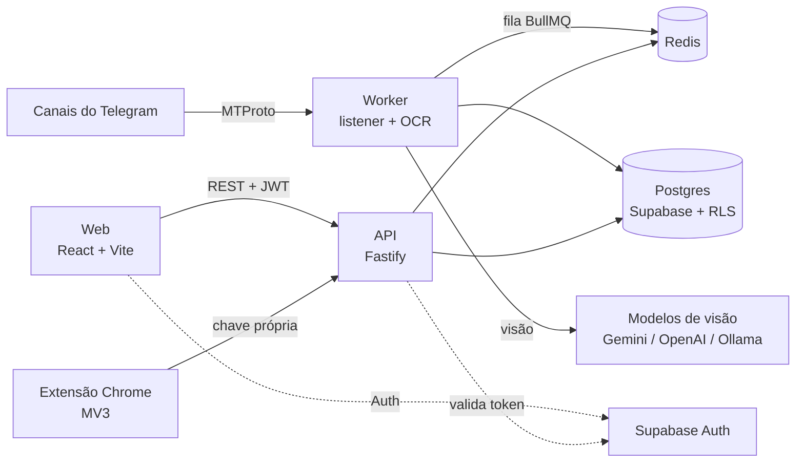

# Evobo

Plataforma de gestão de apostas esportivas. Ela captura tips de canais do Telegram em tempo real, lê os comprovantes com IA (OCR por modelos de visão), confere os resultados e calcula banca, ROI e desempenho por grupo e por casa. Também tem uma extensão de navegador que executa as apostas sob regras que o próprio usuário define.

Desenvolvi sozinho, do banco de dados à extensão, e o sistema está em produção desde julho de 2026.

> ⚠️ **Repositório público só para portfólio.** O código pode ser lido, mas não pode ser usado, copiado nem redistribuído. Veja a [LICENSE](LICENSE).

---

## Destaques técnicos

- **Monorepo TypeScript** com npm workspaces: API, frontend, worker, extensão e pacotes compartilhados, todos com tipos e schemas (Zod) em comum.
- **Pipeline em tempo real com Telegram (MTProto)**: listener com GramJS, *polling* de segurança para quando o *push* atrasa ou se perde, *watchdog* de conexão e deduplicação de mensagens.
- **OCR com modelos de visão**: os comprovantes viram dados estruturados (jogo, mercado, odd, unidade). O provedor é plugável (Gemini, OpenAI ou um modelo local no Ollama) e o processamento passa por uma fila com BullMQ + Redis.
- **Conferência automática de resultados** por várias fontes, com matching por similaridade e, nos casos ambíguos, desempate por LLM. A taxa de erro foi medida e está documentada.
- **Extensão Chrome (Manifest V3)** controlada pelo painel web: modos de operação, teto por aposta, histórico de execuções e conferência do bilhete antes de confirmar.
- **Controle de acesso em duas camadas**: papéis e permissões por tela, checados no frontend (UX) e sempre revalidados no backend.
- **Dados em Postgres com RLS** (Supabase) e Prisma. As migrations são versionadas e incluem as policies de segurança.

## Arquitetura



| Pasta | O que é | Stack |
|---|---|---|
| `apps/web` | SPA: feed, ranking, dashboards da banca, relatórios, painel admin | React 19, Vite, Tailwind, React Router |
| `apps/api` | API REST: auth, permissões, banca, importação, aposta automática | Fastify, Prisma, Zod, Supabase |
| `apps/worker` | Listener do Telegram, OCR, conferência de resultados e jobs | GramJS, BullMQ, Playwright |
| `apps/betting-extension` | Extensão de navegador para a aposta automática | Chrome Extensions MV3, JS puro |
| `packages/shared-types` | Schemas Zod e tipos usados pela API e pelo web | Zod |
| `packages/design-tokens` | Tokens de design (cores, status) | TypeScript |
| `packages/robotip-legacy` | Serviço legado (Express) migrado para dentro da API | Express, pg |

## Segurança

O repositório é público, então tratei a segurança como requisito:

- **Sem segredos no código nem no histórico**: tudo vem de variáveis de ambiente ou secrets do provedor, e só os arquivos `.env*.example` são versionados.
- **Autenticação no servidor em toda rota sensível**: o token do Supabase é validado na API e o papel e o status do usuário são recarregados do banco a cada requisição.
- **Credenciais de terceiros criptografadas** com AES-256-GCM, usando *associated data* por usuário e campo. Um valor copiado para outra linha não descriptografa.
- **Chaves de API armazenadas só como hash** (SHA-256), com comparação em tempo constante.
- **Row Level Security** no Postgres, *rate limiting*, Helmet, CORS restrito e erros que nunca expõem detalhes do banco.
- **Logs higienizados**: tokens, cookies e chaves são removidos antes de gravar.
- **Serviços locais** expostos por túnel autenticado, com *allowlist* de rotas, e ouvindo só em *loopback*.

## Rodando localmente

Pré-requisitos: Node 24, Docker (para o Redis) e a [Supabase CLI](https://supabase.com/docs/guides/cli).

```bash
npm ci
cp apps/api/.env.example apps/api/.env      # preencha as variáveis
cp apps/web/.env.example apps/web/.env
cp apps/worker/.env.example apps/worker/.env

docker compose -f infra/docker-compose.yml up -d   # Redis
(cd apps/api && npx supabase start)                # Postgres + Auth locais
npm run dev                                        # API + web
```

| Comando | O que faz |
|---|---|
| `npm run dev` | Sobe a API e o frontend em modo desenvolvimento |
| `npm run build` | Build de todos os workspaces |
| `npm run lint` / `npm run typecheck` | Qualidade e tipos em todo o monorepo |
| `npm run test` | Testes dos workspaces (Vitest) |
| `node --test apps/betting-extension/test/*.test.*` | Testes da extensão (`node:test`) |

## Infraestrutura

- **API + worker**: Fly.io (região GRU), numa única máquina para manter o custo baixo. Tem *health check* e *graceful shutdown*.
- **Frontend**: Vercel, com headers de segurança.
- **Banco e Auth**: Supabase (Postgres).
- **CI**: GitHub Actions rodando lint, typecheck e testes, com token só de leitura.

---

Feito por [@Bllatzz](https://github.com/Bllatzz).
